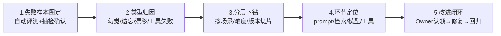

# 四、人工标注与误差分析（L3 分析归因层）

> 对应页面：`04-annotation.html`
> 对应职责：组织人工标注、质量抽检、误差分析和问题归因
> 人工介入的三个定位：**校准者**（为 LLM-as-Judge 提供对齐金标）、**仲裁者**（处理自动评测的分歧与低置信样本）、**分析师**（对失败样本做深度归因）
> 资源原则：人工资源贵，必须用在刀刃上

---

## 1. 标注体系设计

### 1.1 标注规范（Guideline）

每类任务编写标注手册：维度定义、评分锚点（每个分值的正反例）、边界情况裁决规则。规范版本化管理，每次校准会后的修订全员同步。

### 1.2 标注任务类型

| 类型 | 说明 | 适用场景 |
|---|---|---|
| **打分式** | 单答案 1-5 分 | 正确性、相关性等绝对质量评估 |
| **对比式** | A/B 两答案选优或平局 | 更适合感知细微差异 |
| **分类式** | bad case 问题类型归档 | 误差归因 |
| **抽取式** | 标注 evidence 依据片段 | 为 Judge 提供证据链样本 |

### 1.3 金标集（Golden Set）

由资深标注员 + 算法同学共建的高置信度基准集（约 500 条/维度），三大用途：Judge 校准、标注员考核、回归哨兵。

## 2. 标注流程与质量控制（六步）

1. **任务构造**：从评测结果库自动抽取待标注样本——Judge 低置信样本、成对评测分歧样本、新增场景抽样、线上负反馈
2. **背靠背标注**：每条样本至少 3 人独立标注，互相不可见；埋入 5% 金标题实时监控标注员质量
3. **一致性校验**：计算标注员间一致性（Cohen/Fleiss Kappa），Kappa ≥ 0.75 视为规范可执行；低于阈值先回炉校准再继续
4. **仲裁**：3 人意见不一致时由资深标注员 / 算法同学裁决，**裁决结果回写规范附录**
5. **质量抽检**：质检员对已提交标注按 10% 比例盲抽复核，错误率 > 5% 的批次整批退回重标
6. **结果入库**：标注结果回流评测结果库——校准 Judge、修正指标分数、沉淀为新金标 / bad case

### 质控标准

| 质控指标 | 标准 | 参考水位 |
|---|---|---|
| 标注员间一致性 Kappa | ≥ 0.75 | 0.81 |
| 金标题准确率（个人） | ≥ 95% | 97.2% |
| 批次抽检错误率 | ≤ 5% | 2.8% |
| 标注时效（打分任务） | ≤ 24h / 千条 | 18h |
| 规范修订响应（分歧 → 修订） | ≤ 3 天 | 2.1 天 |

> ⚠️ 标注规范是**活的文档**：每条仲裁结论都要沉淀回规范附录（「边界情况案例集」），避免同一类分歧反复出现。

## 3. 误差分析与问题归因方法（Error Analysis）

评测回答「多差」，误差分析回答「为什么差、差在哪、怎么修」。五步分层下钻：

### 3.1 问题类型 → 根因 → 改进手段对照表

| 问题类型 | 常见根因 | 对应改进手段 |
|---|---|---|
| 幻觉 | 知识缺失、检索未命中、过度生成 | 补知识库 / 加引用约束 / 拒答策略 |
| 上下文遗忘 | 窗口截断、关键信息位置偏远 | 压缩策略 / 信息前置 / 分轮摘要 |
| 角色漂移 | 系统提示弱化、长对话稀释 | 人设强化注入 / 周期性提醒 |
| 工具调用失败 | 参数 schema 理解错、接口变更 | 工具描述优化 / 参数校验重试 |
| 安全风险 | 越狱诱导、注入攻击 | 护栏升级 / 红线集回归 |

### 3.2 归因分布示例（某版本）

| 问题类型 | 占比 |
|---|---|
| 检索未命中 → 幻觉 | 34% |
| 指令遵循偏差 | 22% |
| 工具调用失败 | 18% |
| 上下文遗忘 | 14% |
| 其他 | 12% |

> 结论示例：34% 的失败源于检索环节而非模型本身 → 优先优化知识库分片与召回策略，而非换模型。

## 4. 问题闭环管理

- **归因结论工单化**：每个批量问题生成改进工单，明确 Owner、优先级（按 case 量 × 严重度排序）与验收标准（对应回归集指标）
- **周度误差分析会**：评测、算法、平台、产品四方参加，过 Top 问题、拍板改进方案、回顾上周工单关闭率
- **复发监控**：已修复问题进入哨兵状态，回归集中持续监控 2 个版本周期，无复发才归档
- **知识沉淀**：典型问题与归因结论沉淀为「质量知识库」，供 prompt 工程师和产品同学检索学习

### 参考水位

| 指标 | 水位 |
|---|---|
| 归因结论 7 天内闭环率 | 78% |
| 自动评测样本人工抽检比例 | 5% |
| 问题复发率（连续两个版本） | 6%↓ |
