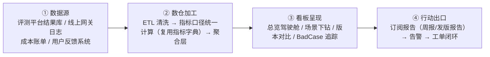

# 五、质量看板（L4 度量运营层）

> 对应页面：`05-dashboard.html`
> 对应职责：搭建质量看板，跟踪效果、稳定性、成本、延迟和安全相关指标
> 核心价值：不是「展示」而是「驱动行动」——每个异常指标都能一键关联到 bad case 明细与对应工单，形成「看到 → 查明 → 修掉 → 验证」的完整路径

---

## 1. 五维质量模型（看板信息架构）

| 维度 | 跟踪指标 | 主题色 |
|---|---|---|
| ✨ **效果** | 正确率、幻觉率、任务完成率、bad case 率、用户点踩率 | 青色 |
| 📈 **稳定性** | 同题输出方差、服务可用性、错误率、失败恢复率 | 蓝色 |
| 💰 **成本** | Token 成本、单任务成本、成本环比、缓存命中率 | 紫色 |
| ⏱️ **延迟** | TTFT P50/P90/P99、端到端耗时、超时率 | 橙色 |
| 🛡️ **安全** | 拦截率、越狱成功率、PII 泄露、安全巡检结果 | 红色 |

## 2. 看板首页指标卡（示意 Demo 数据）

线上版本 `app-2.5.0` vs 基线 `app-2.4.1` · 最近 7 天：

| 指标 | 数值 | 环比 | 状态 |
|---|---|---|---|
| 核心场景正确率 | 93.2% | ▲ 1.8pp | ✅ 健康 |
| 幻觉率（目标 ≤2%） | 1.6% | ▼ 0.4pp | ✅ 达标 |
| Agent 任务完成率 | 86.5% | ▲ 3.2pp | ✅ 健康 |
| 单任务平均成本 | 0.38 元 | ▲ 12% | 🔴 超阈值 |
| TTFT P90 | 1.2s | ▼ 0.2s | ✅ 改善 |
| 服务可用性（SLA 99.9%） | 99.95% | — | ✅ 达标 |
| 安全拦截率 | 99.7% | ▲ 0.3pp | ✅ 健康 |
| 本周新增 Bad Case | 47 例 | ▲ 9 例 | 🟡 需关注 |

## 3. 版本趋势视图

核心正确率近 6 版走势（示意）：

```
版本    2.0.0   2.1.0   2.2.0   2.3.0   2.4.1   2.5.0
正确率  88.1%   89.0%   88.7%   90.2%   91.4%   93.2%
趋势     ██      ██      ██      ███     ████    █████  ← 持续提升
```

看板同时支持：按场景下钻（每个核心场景独立趋势）、按被测维度切片（模型/Prompt/策略/版本）、历史任意两个版本 A/B 对比、bad case 类型堆叠趋势。

## 4. 数据链路



关键设计：指标计算**复用 L0 指标字典口径**，保证评测与看板数据口径一致，杜绝「两套数」。

## 5. 告警机制

| 告警项 | 触发条件 | 响应级别 |
|---|---|---|
| 核心指标跌破门槛 | 正确率 < 门槛值 或幻觉率 > 红线 | 🔴 P0 电话告警 |
| 回归集通过率下降 | 历史 bad case 复发率 > 5% | 🟡 P1 即时消息 |
| 成本异常 | 单任务成本环比 +10% | 🟡 P1 即时消息 |
| 延迟劣化 | TTFT P90 环比 +30% | 🔵 P2 日报 |
| 安全巡检异常 | 红线集任一失守 | 🔴 P0 电话告警 |
