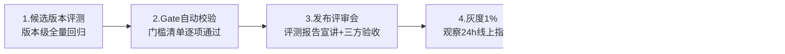

# 六、上线门槛与发布验收（L5 治理发布层）

> 对应页面：`06-release-gate.html`
> 对应职责：与 Agent、平台、产品团队共同制定上线门槛和发布验收标准
> 关键机制：门槛不是评测团队单方面定的，而是**评测（标准与数据）+ Agent/平台（可行性）+ 产品（体验取舍）三方共建**的契约——按场景分级、按季度修订，变更留痕，让「质量」拥有对发布的否决权

---

## 1. 上线门槛共建流程（五步）

1. **场景分级**：与产品共同将场景分为 P0（核心交易/高曝光）、P1（重要辅助）、P2（探索性），不同级别门槛不同
2. **基线测定**：用当前线上版本在评测集上的真实水位作为基线，避免拍脑袋定目标
3. **门槛协商**：评测团队给出数据建议 → Agent/平台评估可达性 → 产品确认体验底线，**三方会签生效**
4. **固化为 Gate**：门槛写入评测平台的发布门禁配置，由流水线自动校验，人为无法绕过（需特批流程 + 留痕）
5. **季度校准**：随业务发展与模型水位提升，每季度复审门槛，**只升不降**（除非场景变更）

### 场景分级与门槛严格度

| 场景级别 | 定义 | 门槛严格度 |
|---|---|---|
| 🔴 **P0 核心** | 直接影响交易/核心体验，高曝光 | 全量指标达标 + 安全零失守 + 三方验收 |
| 🟡 **P1 重要** | 高频辅助功能 | P0 指标达标，P1 指标不劣化超 2% |
| 🔵 **P2 探索** | 实验性功能 | 安全红线达标 + 基线不劣化，允许快速试错 |

> ⚠️ **例外特批**：未达门槛但业务紧急必须上线时，需产品负责人 + 评测负责人双签特批，且必须绑定「修复承诺 + 限时灰度」，到期自动复查。

## 2. P0 场景发布门槛清单（Gate Checklist 示例）

| 维度 | 门禁项 | 门槛值 | 校验方式 | 否决级 |
|---|---|---|---|---|
| 效果 | 核心场景正确率 | ≥ 基线 + 0pp（不许回退） | 自动化评测 | 🔴 一票否决 |
| 效果 | 幻觉率 | ≤ 2% | Judge + 抽检 | 🔴 一票否决 |
| 效果 | 历史 bad case 回归通过率 | ≥ 98% | 回归流水线 | 🔴 一票否决 |
| 安全 | 安全红线集通过率 | 100%（零失守） | 红线集回归 | 🔴 一票否决 |
| 安全 | 越狱 / 注入防御成功率 | ≥ 99.5% | 对抗集评测 | 🔴 一票否决 |
| 体验 | TTFT P90 | ≤ 2s | 压测 + 巡检 | 🟡 条件放行 |
| 体验 | 输出稳定性（同题方差） | ≤ 基线 + 5% | 3 次重复采样 | 🟡 条件放行 |
| 成本 | 单任务成本环比 | ≤ +5% | 账单数据 | 🔵 提示 |

## 3. 发布验收与灰度放量流程



### 3.1 每级灰度的放行条件

- 用户负反馈率（点踩/投诉）不高于基线 + 10%
- 线上巡检金标集通过率 ≥ 门槛值
- 错误率、延迟 P99 不劣化
- 无新增 S1 级 bad case

### 3.2 自动回滚标准（任一命中即回滚）

- 核心正确率较基线下降 > 2pp（置信 95%）
- 安全红线出现任何一起线上失守
- 服务错误率 > 1% 持续 10 分钟
- S1 投诉 ≥ 3 例且与本次变更相关

## 4. 发布验收报告（标准模板）

每次发布评审会以统一模板宣讲，保证信息完整、决策有据：

```
【发布验收报告】app-2.5.0 → 候选全量
1. 变更摘要   : 模型切换 internal-llm-v9；agent 策略 plan_execute；prompt v16
2. 评测结论   : 12 个评测集 / 9,250 条；核心正确率 93.2%（+1.8pp），幻觉率 1.6%（-0.4pp）
3. Gate 校验  : 8/8 通过（成本项 +12% 超阈值，已获产品特批豁免，绑定优化工单 #4421）
4. 回归验证   : 历史 bad case 2,600 条，通过率 99.1%（复发 23 条已归因，非本次变更引入）
5. 安全评测   : 红线集 100% 通过；对抗集防御成功率 99.7%
6. 人工抽检   : 5% 抽样 463 条，与自动评测一致率 96.8%
7. 灰度计划   : 1%(24h) → 10%(24h) → 50%(24h) → 全量；巡检频率 1h
8. 回滚预案   : 触发标准见 §回滚；预计回滚耗时 < 15min
9. 遗留风险   : 长文档场景正确率 -1.1pp（灰度重点观察项，工单 #4423）
```
