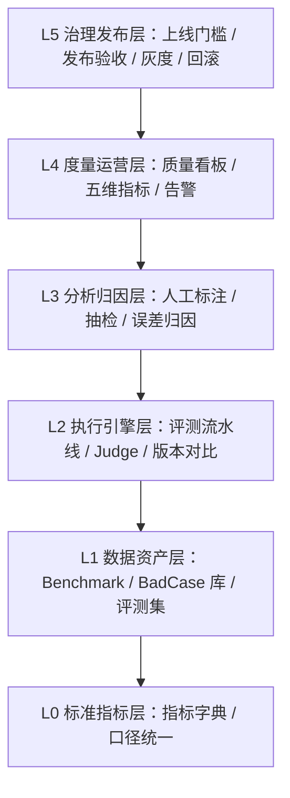
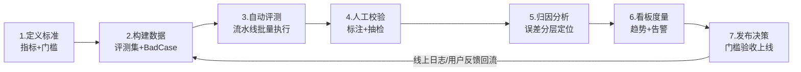

# 〇、大模型评测架构体系 · 总览

> 对应页面：`index.html`
> 定位：面向 **LLM / Agent / 多模态应用** 的一站式评测体系架构总纲

---

## 1. 体系定位

以「指标标准 → 数据资产 → 自动化执行 → 分析归因 → 度量运营 → 发布治理」六位一体闭环，支撑模型、Prompt、Agent 策略与产品版本的全维度质量评测与持续回归。

核心能力概览：

| 能力 | 说明 |
|---|---|
| 六大核心节点 | 覆盖评测全生命周期 |
| 120+ 可量化评测指标 | 效果 / 体验 / 安全 / 成本 |
| 85% 评测执行自动化率 | 人工聚焦高价值判断 |
| 3 层回归防线 | Commit 级 / 版本级 / 线上巡检 |

## 2. 总体架构分层图（自下而上）

| 层级 | 名称 | 核心组件 |
|---|---|---|
| **L5 治理发布层** Release Governance | 发榜门槛 | 上线门槛（Release Gate）、发布验收标准、分级发布/灰度策略、安全合规审计、回滚熔断机制 |
| **L4 度量运营层** Metrics & Operation | 成绩单 | 质量看板（Dashboard）、效果/稳定性/成本/延迟/安全指标、线上监控与告警、评测 ROI 分析 |
| **L3 分析归因层** Analysis | 错题分析 | 人工标注平台、质量抽检、误差分析与问题归因、Bad Case 沉淀回流 |
| **L2 执行引擎层** Eval Engine | 阅卷机 | 自动化评测流水线、规则/代码评测器、LLM-as-Judge、回归测试与版本对比、Agent 轨迹评测 |
| **L1 数据资产层** Data Assets | 考卷 | 场景 Benchmark、Bad Case 库、评测集构建（真实日志/合成/竞品）、数据清洗与去重、分层抽样管理 |
| **L0 标准指标层** Metric Standard | 标尺 | 评测指标体系、正确性/相关性/幻觉率、工具调用成功率/安全风险、体验抽象（延迟/稳定性/成本） |

> 通俗理解：**L0 是「标尺」，L1 是「考卷」，L2 是「阅卷机」，L3 是「错题分析」，L4 是「成绩单」，L5 是「发榜门槛」。**

## 3. 六大核心节点导航

| 节点 | 对应页面 | 对应岗位职责 | 一句话定位 |
|---|---|---|---|
| ① 评测指标体系 | `01-metrics.html` | 建立 LLM / Agent / 多模态应用的评测指标 | 把主观体验抽象成可测指标 |
| ② Benchmark 与 Bad Case 库 | `02-benchmark.html` | 设计并维护覆盖核心场景的 benchmark 和 bad case 库 | 分层构建 + 线上回流 + 持续保鲜 |
| ③ 自动化评测与回归 | `03-automation.html` | 建设自动化评测能力，支持多版本对比 | 把跑评测变成像 CI 一样的基础设施 |
| ④ 人工标注与误差分析 | `04-annotation.html` | 组织人工标注、质量抽检、误差分析和问题归因 | 校准者 + 仲裁者 + 分析师 |
| ⑤ 质量看板 | `05-dashboard.html` | 搭建质量看板，跟踪五维指标 | 不是展示，而是驱动行动 |
| ⑥ 上线门槛与发布验收 | `06-release-gate.html` | 与各方共建上线门槛和发布验收标准 | 质量对发布拥有否决权 |

## 4. 评测生命周期闭环（Eval Loop）

第 7 步上线后，线上回流日志与用户反馈将重新进入第 2 步（构建数据），形成**持续闭环**——评测体系不是一次性项目，而是与研发流程共生的基础设施。

## 5. 角色分工与协同（RACI）

| 角色 | 核心职责 | 在评测体系中的位置 |
|---|---|---|
| **评测团队** | 指标定义、评测集维护、评测平台建设、归因分析、发布验收 | 体系的 Owner，全流程主导（R/A） |
| **Agent / 平台团队** | 提供被测对象接入、策略实验、问题修复 | 被测方 + 门槛共制方（C） |
| **产品团队** | 定义核心用户场景、体验标准、上线取舍 | 场景输入 + 验收决策方（A） |
| **运营 / 客服** | 反馈线上 bad case、用户投诉、场景痛点 | Bad Case 回流来源（C） |
| **标注团队** | 执行标注任务、参与校准与抽检 | 数据质量执行方（R） |

## 6. 落地路线图建议

| 阶段 | 周期 | 关键交付 |
|---|---|---|
| 一期：夯基 | 1~2 月 | 指标字典 v1 + 核心场景评测集 v1 + 规则评测器 + 冒烟回归接入 CI |
| 二期：提速 | 2~3 月 | 评测平台（调度/对比/报告）+ LLM-as-Judge 及金标校准 + 版本级全量回归 |
| 三期：闭环 | 3~4 月 | 标注平台与误差分析流程 + 质量看板与告警 + 发布 Gate 固化 |
| 四期：深水区 | 持续 | Agent 轨迹评测、多模态评测、对抗评测、bad case 自动聚类归因 |
